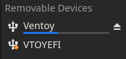

# Steam deck dual boot guide

### Hardware Required:
Steam Deck  
PC  
USB-C thumb drive (or usb drive with usb-c hub/adapter)

### Software required:
- [ventoy](https://www.ventoy.net/en/download.html)
- [gparted](https://gparted.org/download.php) (latest amd64 image)
- [windows10](https://www.microsoft.com/en-us/software-download/windows10ISO) 
- [Steam Deck recovery image](https://help.steampowered.com/en/faqs/view/1B71-EDF2-EB6D-2BB3)  (optional)
- [Steam Deck Windows drivers](https://help.steampowered.com/en/faqs/view/6121-ECCD-D643-BAA8) 

## PC Steps

### Prepare USB:
Install ventoy to USB  
[https://www.ventoy.net/en/doc_start.html](https://www.ventoy.net/en/doc_start.html) 

You should now have two drives mounted on your PC  
 

Copy the windows and gparted ISOs directly to the 'Ventoy' mounted disk  
If you downloaded the Steam Deck recovery image extract it and place the .img file on the same Ventoy volume.  